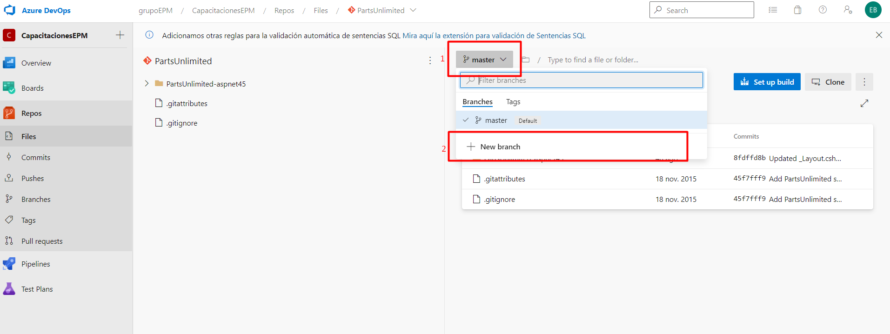
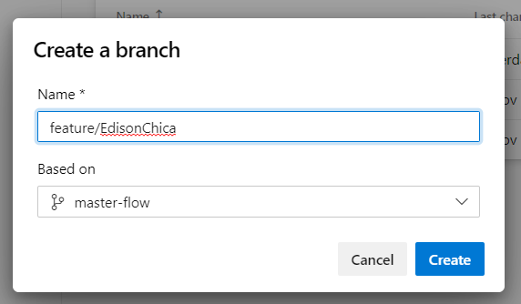
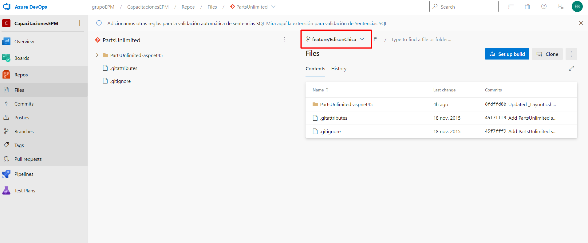

Ahora se requiere crear una feature del repositorio para realizar los cambios. Para realizar este proceso debe de seleccionar el menú desplegable de las ramas y seleccionar **+ New brach** tal como se puede visualizar en la siguiente imagen.

Para crear la rama, debe seguir el patrón **feature/SuNombre** tal como se ve en el siguiente ejemplo

Para finalizar este proceso, presione el botón **Create** e inmediatamente su repositorio se ubicará en la rama que acabó de crear. 

