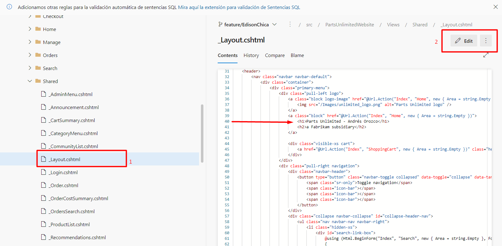
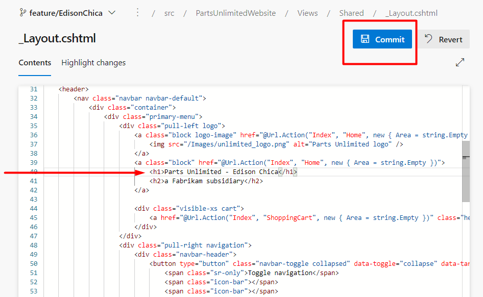
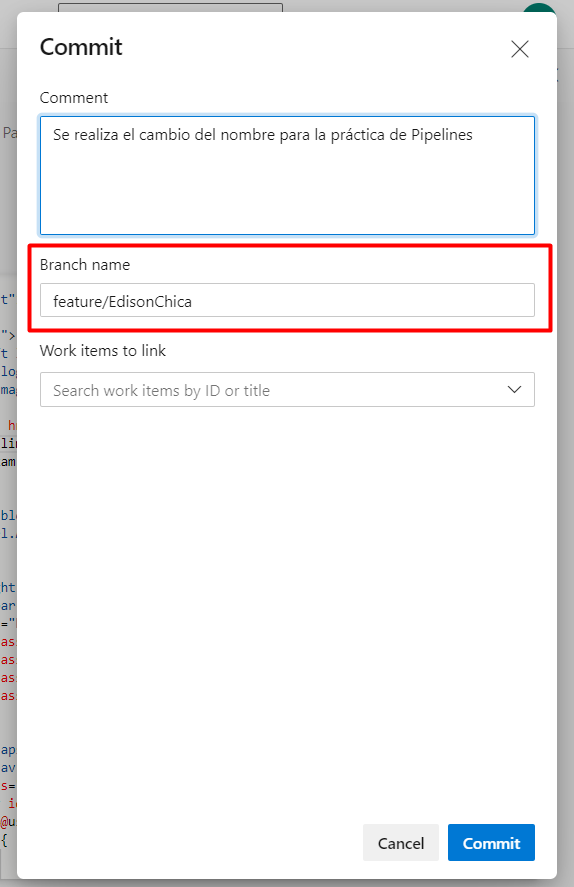

Para continuar tenga en cuenta que el repositorio debe de estar en la rama que creó en el paso anterior _feature/SuNombre_

En este momento se va a realizar el cambio al archivo que luego veremos en el despliegue.

Para ello debe de ingresar al archivo **PartsUnlimited-aspnet45/src/PartsUnlimitedWebsite/Views/Shared/_Layout.cshtml**

Después de localizar el archivo al lado derecho de su pantalla, presione el botón editar y ubíquese en la línea **40**. 

En esa línea usted cambiará el nombre Andrés Orozco por el suyo. Para finalizar presione el botón commit

Una vez presionado este botón, se cargará una ventana con la información para  completar el commit. Verifique nuevamente que este commit se esté realizando a la rama que creó anteriormente.

