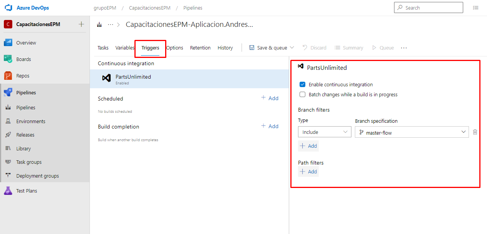

**Nota Importante:** Vamos a omitir la configuración de este paso, debido a que posteriormente cuando cada uno tenga los pipelines configurados con esta opción, a la hora de efectuar un pull request e integrar los cambios con la rama de **master-flow**, se dispararía la ejecución automática para cada uno, obteniendo un resultado no esperado, sin embargo es relevante plasmar y observar como es de simple el configurar esta opción en nuestra definición de pipeline de build.

En esta sesión ajustaremos la opción de la integración continua, permitiendo de esta manera, la ejecución automática de la definición de pipeline de build una vez se realice la integración de cambios para un rama específica.

En este caso, configuraremos la integración continua con la rama de master-flow. Para llevar a cabo esta configuración, navegar a la pestaña de **Triggers** en la definición del pipeline, una vez allí, ubicados en la pestaña de continuos integration, habilitar la opción **"Enable continuous integration"**, una vez seleccionada, se despliegan otras configuraciones adicionales, y entre ellas el **"Branch filters"**, allí seleccionaremos la respectiva rama de master-flow en la opción de **"Branch specification"**.

