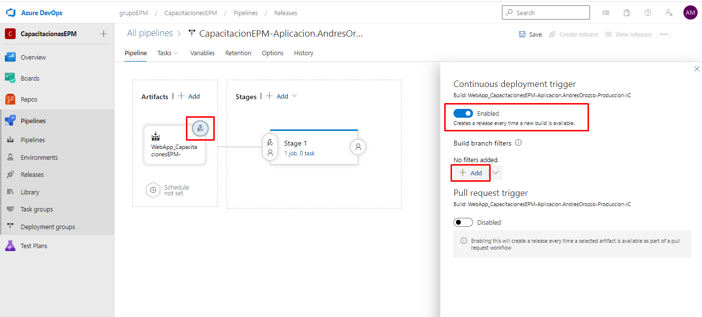
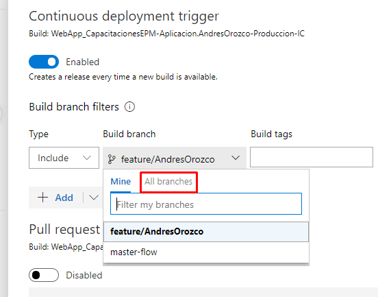

Una vez allí, nos dirigimos a la sección de Artifacts y añadiremos un nuevo artefacto, en este seleccionaremos el pipeline de integración continua creado anteriormente por ustedes en la variable de Source (build pipeline), una vez seleccionado la definición, en el source alias añadiremos la palabra clave que identifica el componente, siendo este una aplicación web, añadiremos al inicio **WebApp**. Una vez finalizado el proceso damos clic en **Add**.

Una vez agregado el artefacto que se utilizará para llevar a cabo la implementación, habilitaremos el disparador de implementación continúa, agregando un filtro correspondiente a la rama de compilación, de esta manera aseguramos que cuando se finalice la ejecución de pipeline de integración continua, automáticamente se dispare la ejecución de este. Para este escenario el filtro será con la rama de **feature/suNombre**

En caso de que no pueda encontrar la rama feature/suNombre en el filtro de Mean, filtrar por All Branches donde allí se listarán todas las ramas configuradas actualmente.

