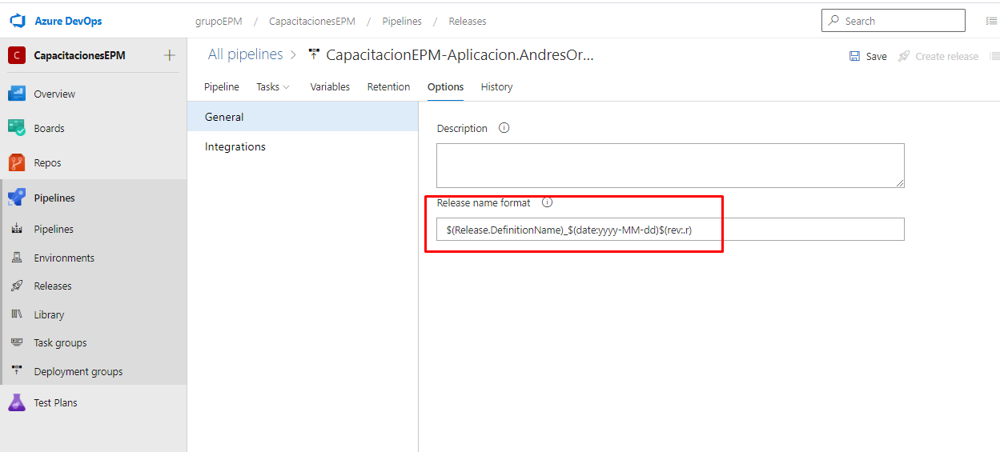

En esta sesión, ajustaremos el formato del release, el cual se estaría viendo reflejado en cada una de las ejecuciones realizadas del pipeline.

Para ajustar esta propiedad, dirigirse a la pestaña de **Options**, una vez allí, se identifica el valor denominado **"Release name format"**, en este se reemplaza por el siguiente valor: **$(Release.DefinitionName)_$(date:yyyy-MM-dd)$(rev:.r)**.

Este se compone de lo siguientes variables: 

**$(Release.DefinitionName):** Nombre de la definición del pipeline de release.
**$(date:yyyyMMdd):** Fecha actual de la ejecución configurada en   año-mes-día.
**$(rev:.r):** El número de la versión ejecutada.
