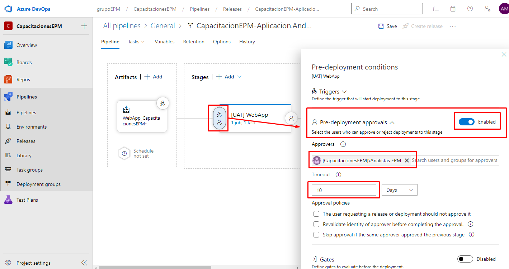

Teniendo en cuenta la definicón establecida para las aprobaciones en los pipelines de release contempladas en el siguiente documento [Estándares en Pipelines de Release](https://epmco.sharepoint.com/:w:/r/sites/devops/_layouts/15/Doc.aspx?sourcedoc=%7B80C2D10A-E4E4-46F9-A7CF-496F746796B7%7D&file=Est%C3%A1ndares%20de%20nombramiento%20pipelines%20de%20releases.docx&action=default&mobileredirect=true), se debe llevar a cabo la siguiente configuración:

Ingresar en las **Pre-deployment conditions**, una vez allí habilitar la opción de **Pre-deployment approvals** y en la opción de Approvers añadir al grupo de **[CapacitacionesEPM]\Analistas EPM**.

Adicionalmente, en la opción de Timeout establecer un valor de 10 días, este valor especifica el tiempo máximo permitido para realizar la aprobación de lo contrario rechaza la ejecución automáticamente.

