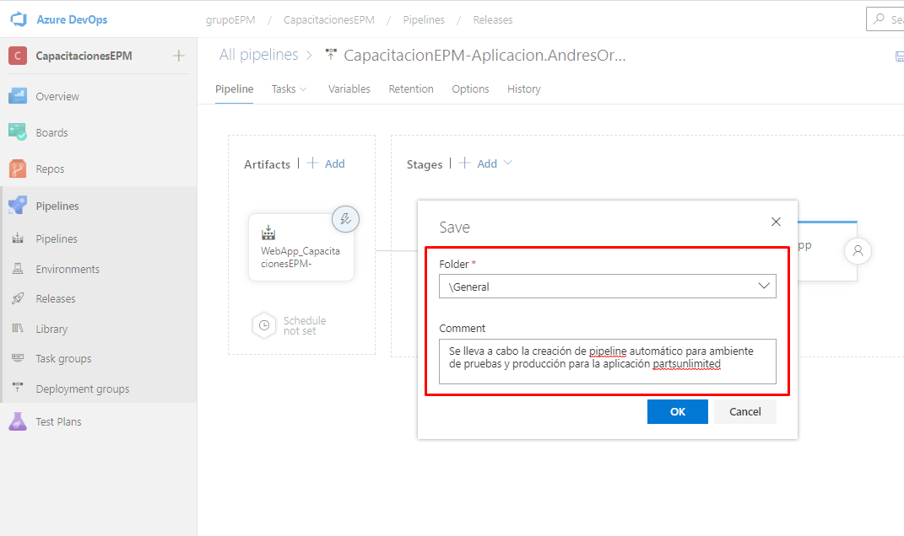

Una vez tengamos todos los cambios realizados, se procede a guardar la configuración del pipeline.

Una vez estemos guardando la definición, se visualiza un recuadro en el cual se observa lo siguiente: 

1. **Folder:** La carpeta donde se almacenará la definición del pipeline, para este caso, lo guardamos en la carpeta denominada **General**.

2. **comment**: Ingresar un comentario con los cambios que fueron realizados en la definición del pipeline, en este caso, ingresamos un comentario alusivo con la creación del pipeline de implementación para la determinada aplicación de PartsUnlimited.

