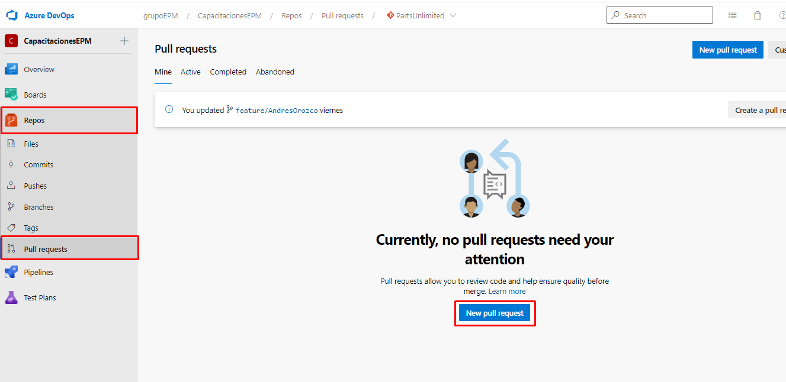
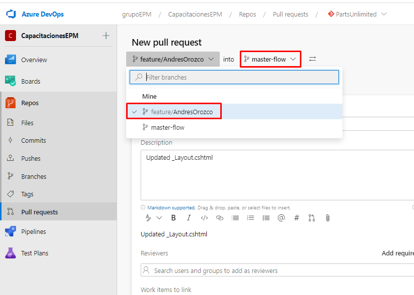
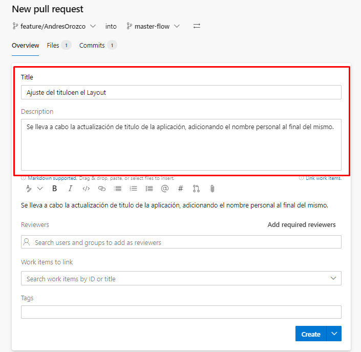

Ubicados en el módulo de repositorios, ingresamos a la pestaña de pull request, y creamos un nuevo pull request.

Una vez nos encontremos en la creación del pull request, seleccionamos en el primer valor denominado **"Select a source branch"** la rama creada por ustedes en un anterior escenario, y en en la siguiente rama validamos que este **"master-flow"**, esto quiere decir que voy a llevar los cambios realizados de la rama que realice los cambios hacia la rama principal que es master-flow.

Una vez realizado el paso anterior, rellenamos la información solicitada para la generación del pull request: 

- **Title:** Adicionamos un título referente a los cambios realizados, por ejemplo Se ajusta el título del aplicativo Web.

- **Description:** Una descripción detallada de lo realizado, por ejemplo, Se ajusta el título ya existente de la aplicación.

Una vez ingresados estos campos, damos clic en **create**.

**Nota:** A nivel general en Azure DevOps de grupo EPM, se tiene definida para las ramas de seguridad base, por ejemplo (desarrollo, pruebas, produccion, master-datos, master-flow), una serie de condiciones para permitir realizar implementaciones en estas, tales como:

**Aprobaciones:** Este consta de establecer una aprobación por parte de un grupo en particular, el cual un solo miembro del grupo correspondiente, se encargará de detallar y analizar los cambios realizados y a partir de ello determinar la integración de los cambios en las ramas.

**Vincular elementos de trabajo:** Consta de asociar un Work Item al pull request creado, obteniendo de esta manera trazabilidad frente al ciclo de vida de desarrollo.

**Comentarios:** En caso de que se realicen comentarios en el pull request, este se bloquea automáticamente, hasta que sea resuelto el mismo.