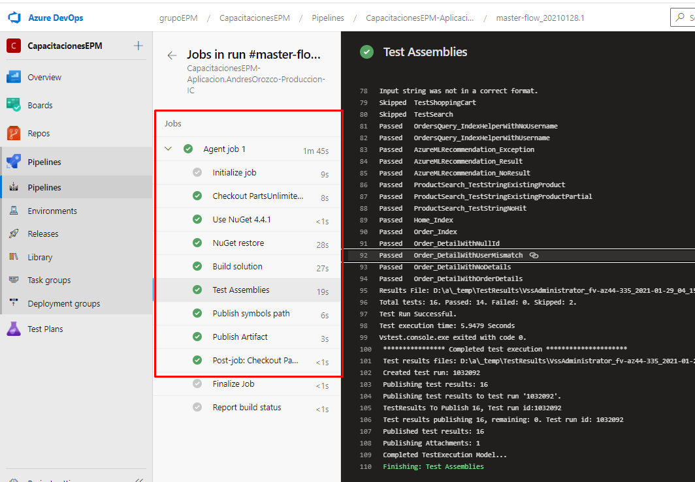

Navegaremos hacia el pipeline creado anteriormente dando clic sobre él, una vez allí procedemos con la ejecución del mismo dando clic sobre el botón **Run pipeline** y posteriormente en el botón de **Run**;

En este puedes entrar en detalle del estado de la ejecución, en el cual podrás observar la ejecución de cada una de las tareas, hasta su última tarea encargada de publicar el respectivo artefacto desplegable.

Una vez finalizada la ejecución del pipeline, puedes observar en el detalle diferentes valores, tales como: artefactos, los cambios realizados, resumen de los resultados de las pruebas unitarias, Work items asociados a la última implementación en la rama ejecutada, etc.

