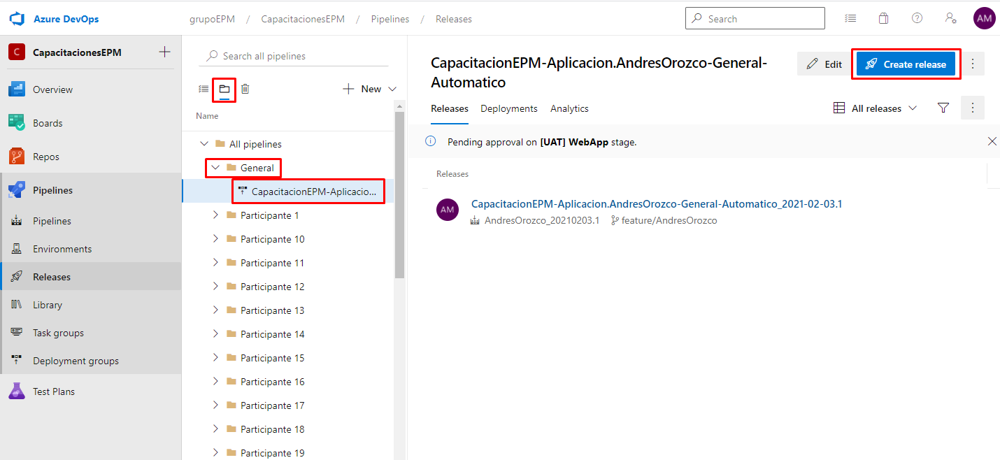
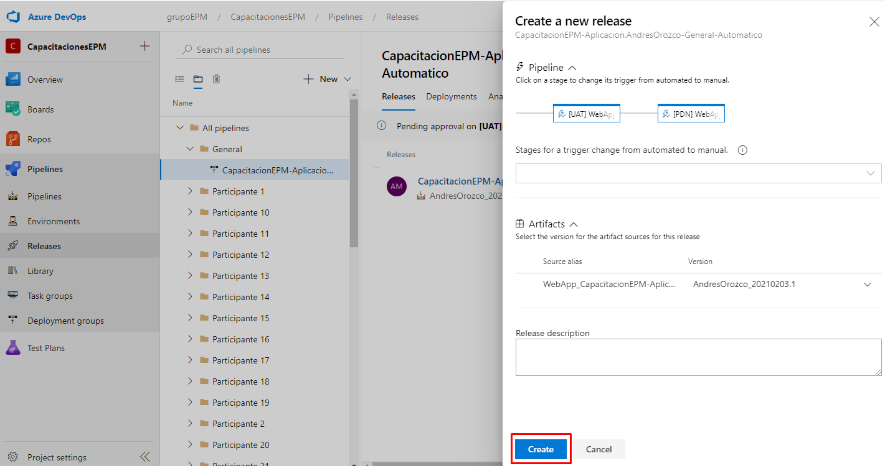
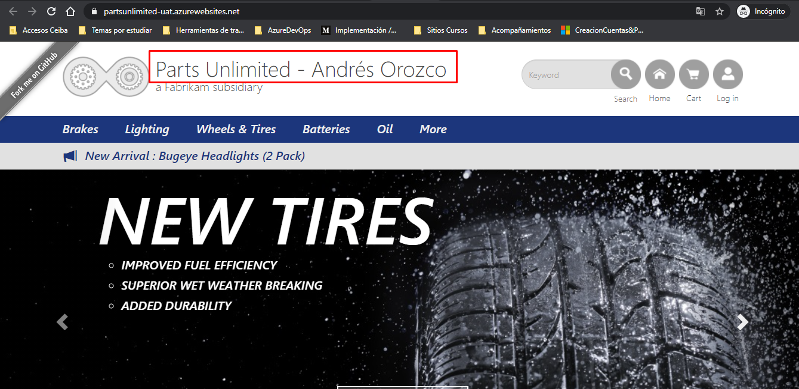

Ya una vez finalizada la ejecución del pipeline de integración continua, automáticamente se ejecuta el pipeline de entrega continua, en caso tal de que no observes que haya sido ejecutado, dirigirse a la pestaña con el ícono de una carpeta, allí encontrarás la carpeta de **General** en donde estará almacenado el pipeline creado por ustedes y efectuar manualmente la ejecución como se menciona en los siguientes pasos. En este se tiene configurado una serie de aprobaciones, las cuales fueron definidas anteriormente, por consiguiente, se aprobará **secuencialmente** cada una de las ejecuciones, con el fin de observar en detalle y ordenadamente los cambios realizados por cada uno de ustedes en una aplicación web real.

- Ejecución del pipeline manualmente en caso tal de no ejecutarse con el trigger.

Finalmente, podrán observar en el título del aplicativo, el nombre que anteriormente fue modificado por ustedes a medida que se van realizando las implementaciones desde Azure DevOps.

