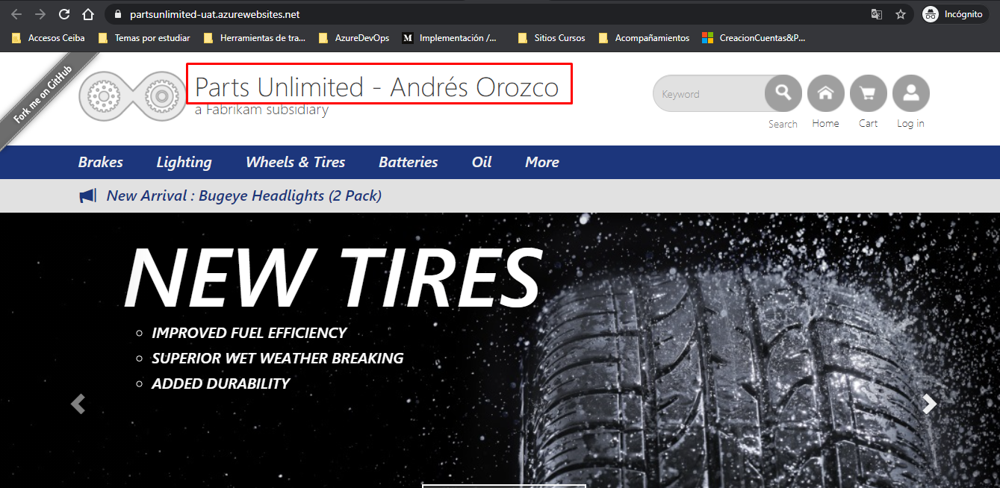

Ya una vez finalizada la ejecución del pipeline de integración continua, automáticamente se ejecuta el pipeline de entegra continua, en este se tiene configurado una serie de aprobaciones, las cuales fueron definidas anteriormente, por consiguiente, se aprobará **secuencialmente** cada una de las ejecuciones, con el fin de observar en detalle y ordenadamente los cambios realizados por cada uno de ustedes en una aplicación web real.

Finalmente, podrán observar en el titulo del aplicativo, el nombre que anteriormente fue modificado por ustedes a medida que se van realizando las implementaciones desde Azure DevOps.

