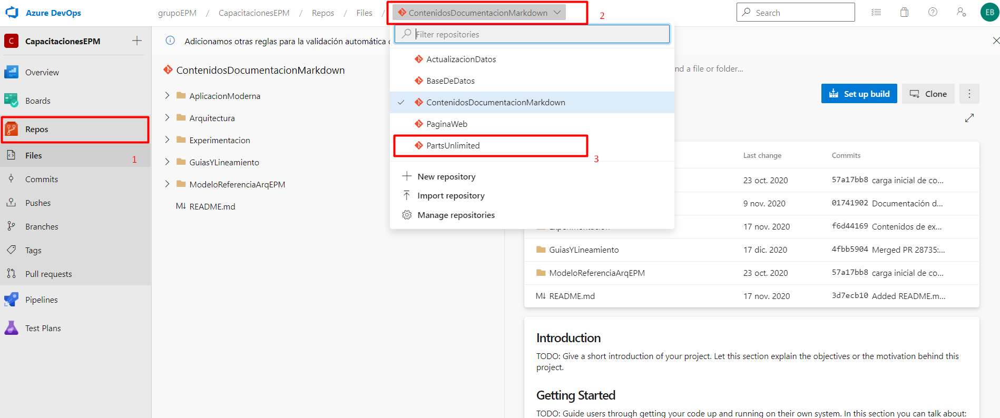
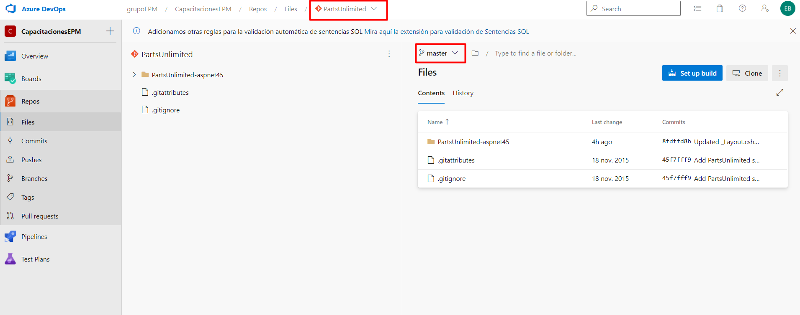

Al lado izquierdo de su pantalla de inicio del proyecto encontrará la opción Repos. Debe de ingresar a ésta y ubicarse dentro del repositorio del proyecto PartsUnlimited.

Y debe de cargar el repositorio con la carpeta del proyecto para hacer la práctica ubicado en la rama **master**

