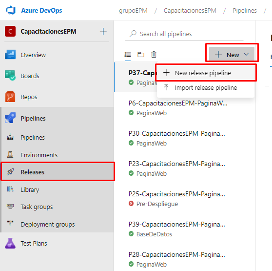
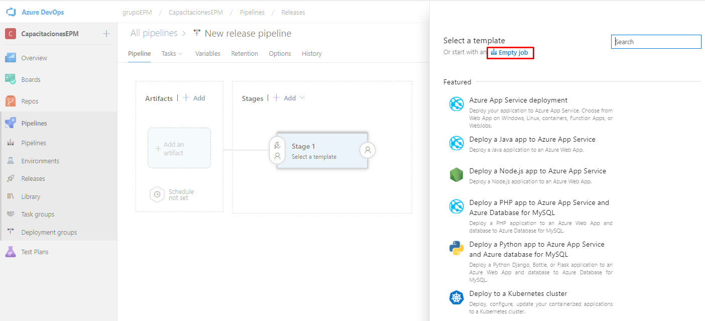

Ubicados en el proyecto de CapacitacionesEPM en la organización de grupoEPM, dirigirse al módulo de Pipelines y navegar hacia la pestaña de Releases.

Una vez allí, identificamos el boton **New**, damos clic sobre este, y sobre la lista desplegada, damos en clic en **New release pipeline**

En esta sección se carga todas las **plantillas** que provee Azure DevOps. En esta seleccionamos Empty Job en la parte superior.

