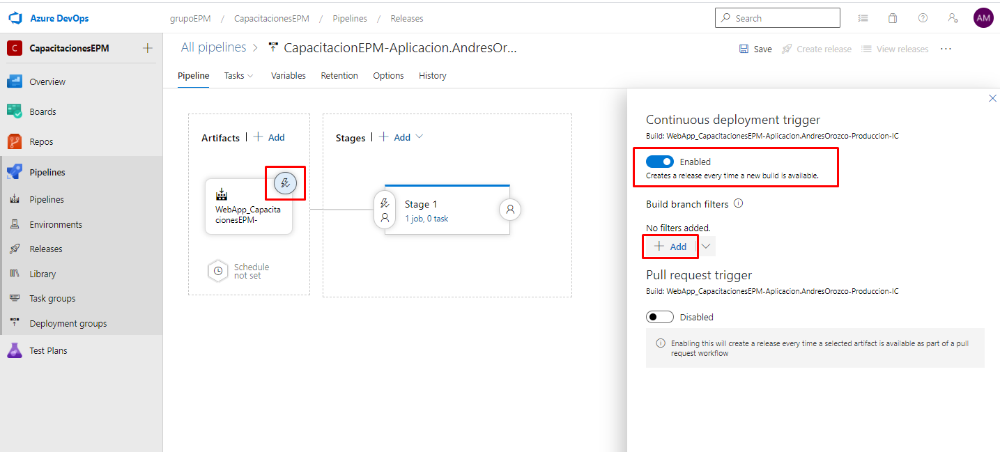

Una vez allí, nos dirigimos a la sección de Artifacts y añadiremos un nuevo artefacto, en este seleccionaremos el pipeline de integración continua creado anteriormente por ustedes en la variable de Source (build pipeline), una vez seleccionado la definicion en el source alias añadiremos la palabra clave que identifica el componente, siendo este una aplicación web, añadiremos al inicio **WebApp**. Una vez finalizado el proceso damos clic en **Add**.

Una vez agregado el artacto que se utilizará para llevar a cabo la implementación, habilitaremos el disparador de implementación continua, agregando un filtro correspondiente a la rama de compilación, de esta manera aseguramos que cuando se finalice la ejecución de pipeline de integración automáticamente se dispare la ejecución de este. Para este escenario el filtro será con la rama de **master-flow**

