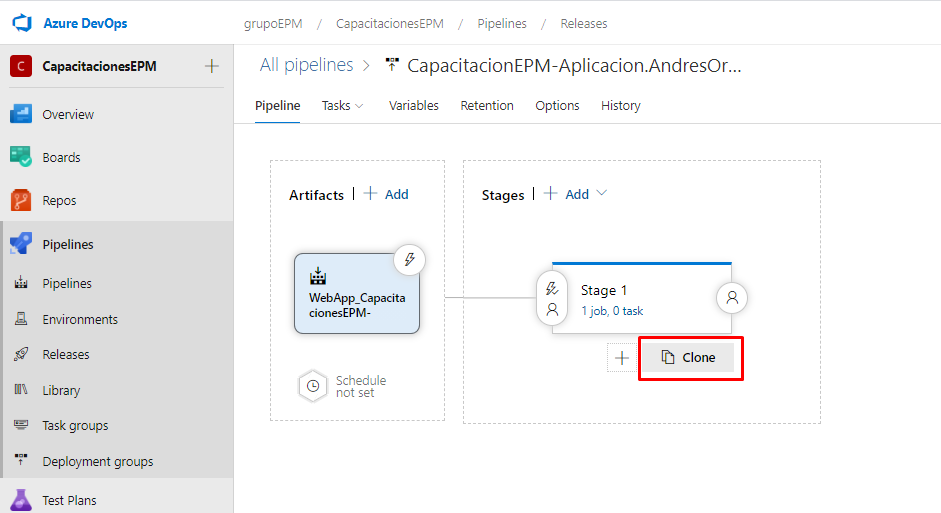
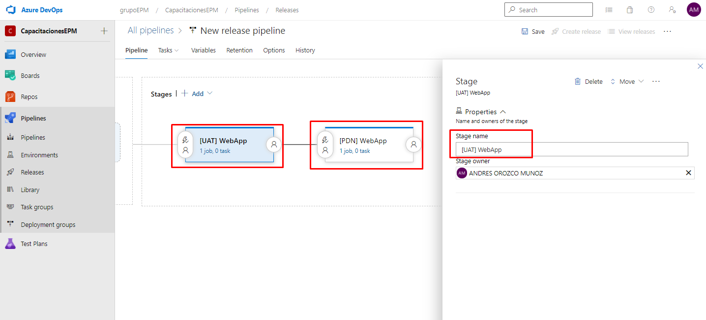

En esta sesión ajustaremos el nombre de los stages acorde a la definición establecida, esta la pueden observar en el boletín publicado en el proyecto de Escalando DevOps [Boletín N°8 - Estándar de nombramiento para los pipelines](https://dev.azure.com/grupoepm/EscalandoDevOpsEPM/_wiki/wikis/EscalandoDevOpsEPM.wiki/742/Bolet%C3%ADn-N%C2%B08-Est%C3%A1ndar-de-nombramiento-para-los-pipelines).

Antes de entrar en el nombramiento de los stages, procederemos a clonar un stage a partir del ya existente de la siguiente manera, este se realiza ubicando el mouse encima del stage y posterior a ello saldrá la opción de **Clone**.

Nuestro pipeline de release realizara la implementación en dos ambientes (Pruebas y Produccion), teniendo en cuenta la definición, debemos especificar cual stage corresponde al respectivo ambiente, por consiguiente, el stage 1 corresponde al ambiente de pruebas y el stage 2 corresponde al ambiente productivo. De esta manera quedaría el nombramiento para cada uno de los stages: 

- Stage 1 se reemplaza por el valor de = [UAT] WebApp
- Copy of Stage 1 se reemplaza por el valor de = [PDN] WebApp

Para modificar su nombre, simplemente dar clic sobre el stage, posteriormente, se visualiza el cuadro de la configuración del Stage incluyendo el nombre del mismo.
