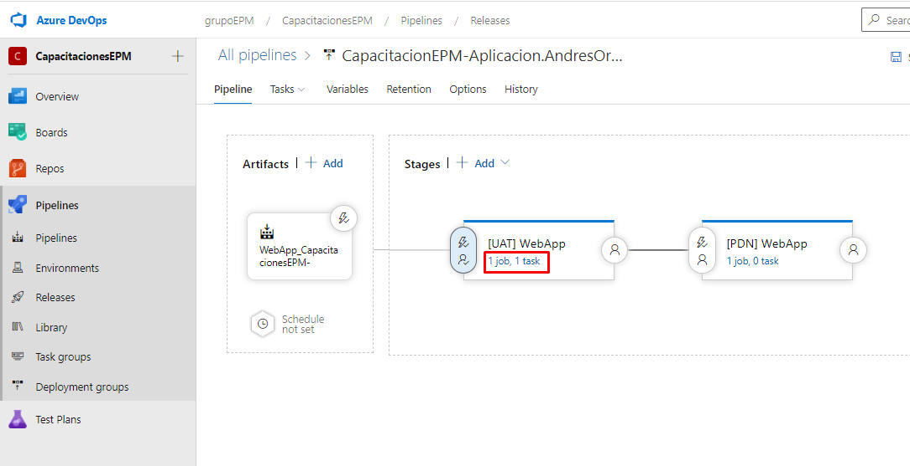
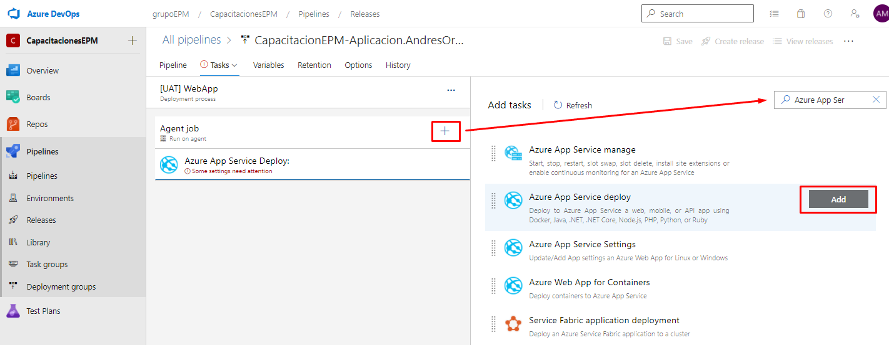
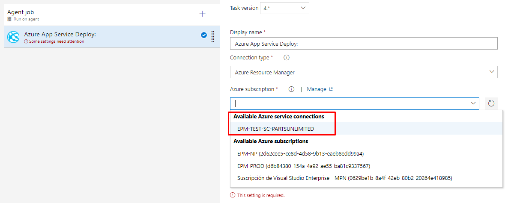
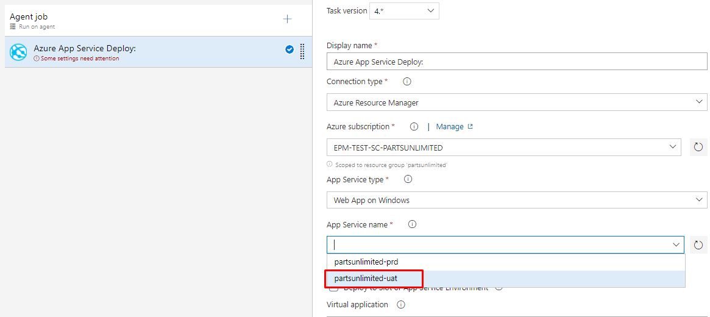
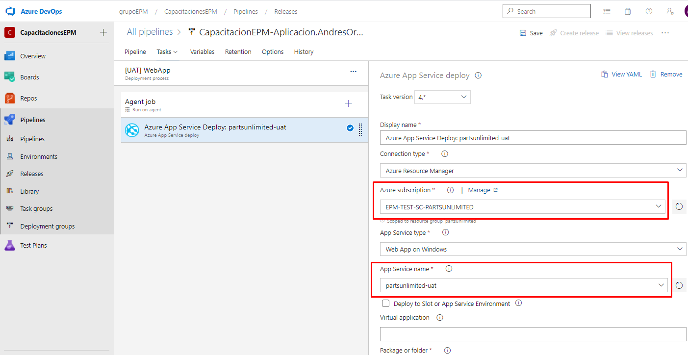

En esta sección añadiremos la tarea encargada realizar la implementación de nuestra aplicación web en un entorno de pruebas y producción.

Para proceder con su configuración, ingresamos en 1job, 1tarea en el Stage de **[UAT] Web App**

Una vez allí, añadiremos una nueva tarea al JOB, denominada **Azure App Service deploy**.

Una vez seleccionada, procedemos con la configuración de la tarea, los cuales son los siguientes: 

- Azure Suscription: En este seleccionaremos el service connection llamado **"EPM-TEST-SC-PARTSUNLIMITED"**. Este nos proporciona una conexión de servicio externo, en este caso **Azure**.

- App Service Name: En este seleccionaremos el servicio de aplicacion llamado **partsunlimited-uat**

Finalizada la configuración se debería ver de la siguiente manera.

Una vez realizada la respectiva configuración de la tarea, replicar lo mismo para el stage de **[PRD] Web App** con la diferencia que en el App Service Name seleccionan el servicio de aplicación llamado **partsunlimited-prd**