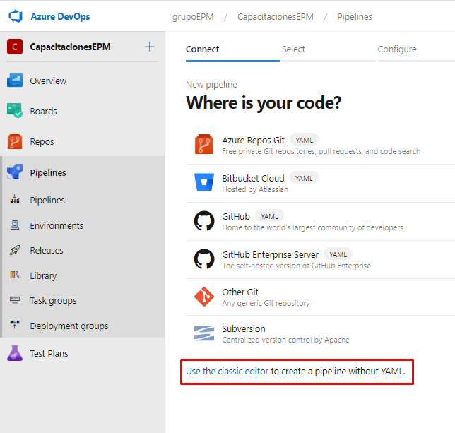
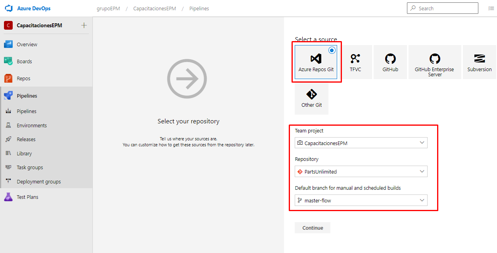
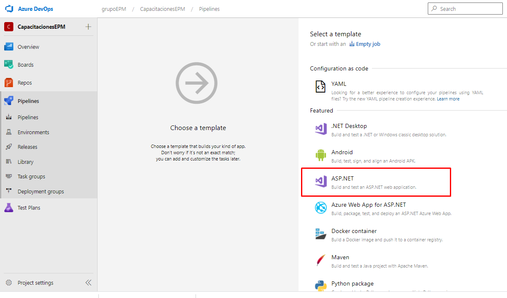

Ubicados en el proyecto de CapacitacionesEPM en la organización de grupoEPM, dirigirse al módulo de Pipelines y navegar hacia la pestaña de Pipelines.

Una vez allí, en la parte superior derecha, se encuentra el botón para crear una nueva definición de pipeline de build.

En esta sección seleccionamos la opción en la parte inferior de la pantalla **"Use the classic editor to create a pipeline without YAML"**. De esta manera se llevaría a cabo la creación de la definición mediante el editor clásico.

Seleccionar el repositorio de PartsUnlimited con la rama Master.

En esta sección se carga todas las **plantillas** que provee Azure DevOps. En esta seleccionamos la plantilla de ASP.NET.

Una vez realizado este proceso, se verá reflejado la definición del pipeline con cada una de las tareas pre-configuradas para construir nuestro proyecto de PartsUnlimited.