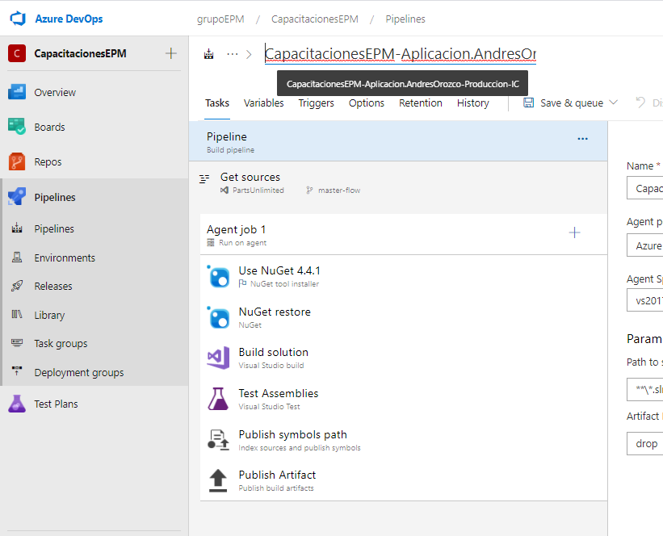

En esta sección ajustaremos el nombre del pipeline acorde a la definición establecida, esta la pueden observar en el boletín publicado en el proyecto de Escalando DevOps [Boletín N°8 - Estándar de nombramiento para los pipelines](https://dev.azure.com/grupoepm/EscalandoDevOpsEPM/_wiki/wikis/EscalandoDevOpsEPM.wiki/742/Bolet%C3%ADn-N%C2%B08-Est%C3%A1ndar-de-nombramiento-para-los-pipelines)

Teniendo en cuenta la definición establecida, el nombre para esta definición se plasmaría de la siguiente manera: CapacitacionEPM-Aplicacion-Produccion-IC

