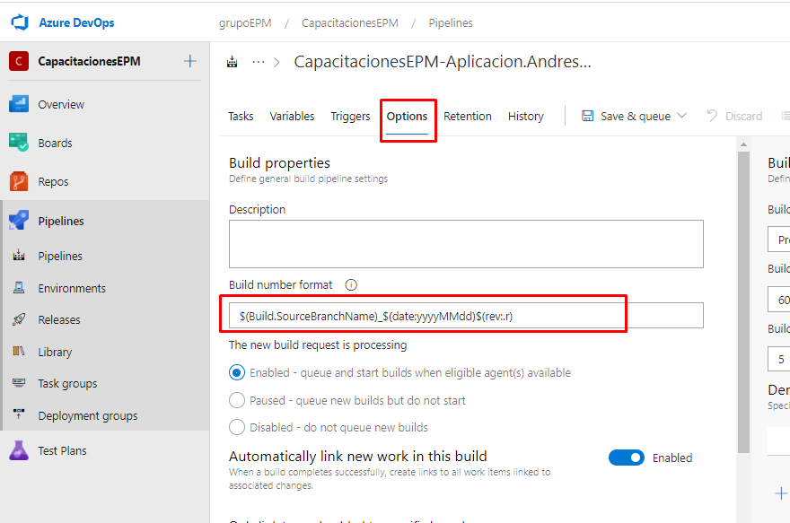

En esta sesión, ajustaremos el formato del build, el cual se estaría viendo reflejado en cada una de las ejecuciones realizadas del pipeline.

Para ajustar esta propiedad, dirigirse a la pestaña de **Options**, una vez allí, se identifica el valor denominado **"Build number format"**, en este se reemplaza por el siguiente valor: **$(Build.SourceBranchName)_$(date:yyyyMMdd)$(rev:.r)**.

Este se compone de lo siguientes variables: 

$(Build.SourceBranchName): La rama configurada en la definición del pipeline para la obtención de las fuentes.
$(date:yyyyMMdd): Fecha actual de la ejecución configurada en año-mes-día.
$(rev:.r): El número de la versión ejecutada.