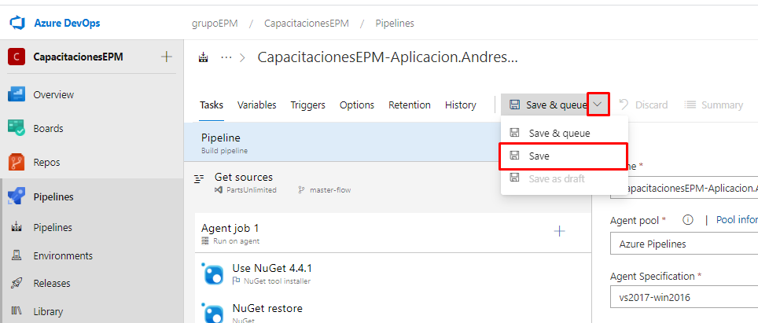
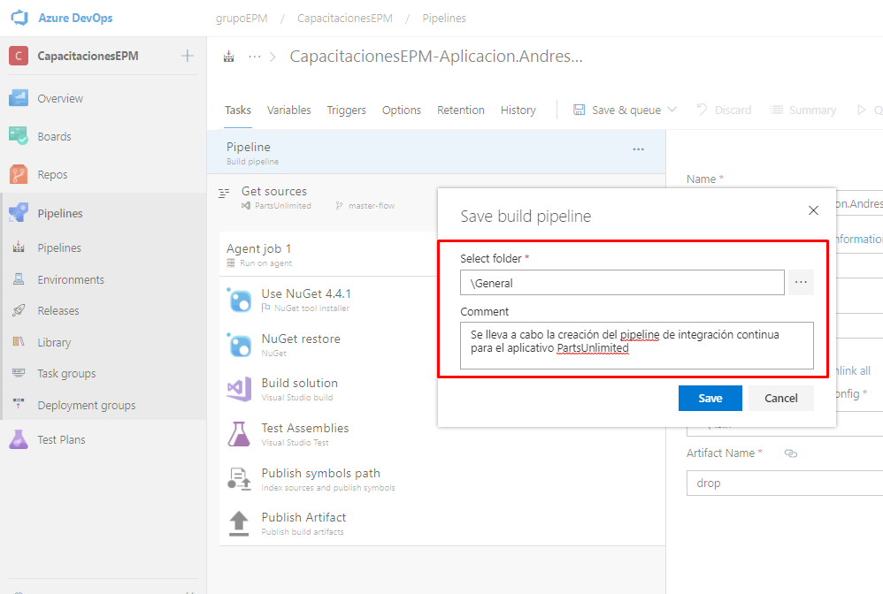

Una vez tengamos todos los cambios realizados, se procede a guardar la configuración del pipeline. A la hora de guardar este, nos topamos con dos opciones save & queue (Esta opción guarda la definición del pipeline y a su vez ejecuta la definicion), la otra opción es el save (Simplemente guarda los cambios realizados) el cual utlizaremos para este caso.

Una vez estemos guardando la definición, se visualiza un recuadro en el cual se observa lo siguiente: 

1. La carpeta donde se almacenará la definición del pipeline, para este caso, lo guardamos en la carpeta denominada general.

2. Ingresar un comentario con los cambios que fueron realizados en la definición del pipeline, en este caso, ingresamos un comentario alusivo con la creación del pipeline para la determinada aplicación de PartsUnlimited.

